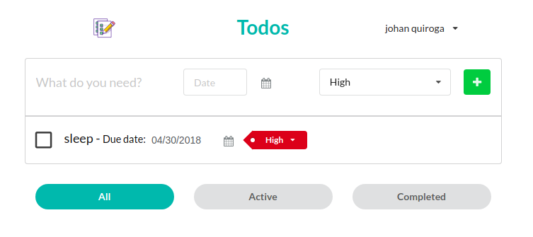

# Todo Items - Cliente



Este proyecto fue generado con [Create React App](https://github.com/facebookincubator/create-react-app).

## Instalación

Para instalar el cliente clona este proyecto con `git clone https://github.com/johanquiroga/todo-items-ui.git`. Una vez descargado se deben instalar las dependencias ejecutando en la carpeta del peoyecto `npm install`.

## Ejecución

Para la correcta ejecución de esta aplicación por favor revisar las [variables de entorno](#variables-de-entorno) necesarias para el correcto funcionamiento. Además, asegurate de que el [servidor](https://github.com/johanquiroga/todo-items-server) esté configurado y ejecutando correctamente.

## Estructura del proyecto

El proyecto está organizado asi

```
my-app/
  README.md
  node_modules/
  package.json
  .env
  public/
    404.html
    CNAME
    index.html
    favicon.ico
  src/
    components/
      TodoApp/
        index.css
        index.js
        index.test.js
        ...
    constants/
      index.js
    HOC/
      index.js
    store/
      actions/
        index.js
        schema.js
      reducers/
        index.js
        ...
      index.js
    api.js
    index.css
    index.js
    localStorage.js
    logo.svg
```

Para que el proyecto se construya correctamente, **estos archivos deben estar exactamente con estos nombres**:

* `public/index.html`;
* `src/index.js` es el punto de entrada de Javascript.

## Scripts disponibles

En la carpeta del proyecto se puede ejecutar:

### `npm start`

Ejecuta la aplicación en modo de Desarrollo<br>
Abre [http://localhost:PORT](http://localhost:3000) para ver en el navegador.

### `npm run build`

Construye y optimiza la aplicación para producción en el directorio `build`.

### `npm run deploy`

Construye y publica la aplicación con Github Pages en el dominio configurado en `package.json`

## Variables de entorno

Para este proyecto se debe configurar una variable de entorno: `REACT_APP_API_URL`. Esta es la dirección completa del servidor y permite la correcta configuración del cliente para las llamadas HTTP.  
 También se debe tener en cuenta que si se van a correr localmente varios proyectos de React.js/Node.js, por ejemplo esta aplicación y el servidor, se debe configurar el puerto de algunos de los dos para que no hayan problemas. Para esta aplicación se puede lograr configurando la variable de entorno `PORT` en el archivo `.env`.

## Publicación

### [GitHub Pages](https://pages.github.com/)

#### Paso 1: Configurar la entrada `homepage` en `package.json`

```json
  "homepage": "https://myusername.github.io/my-app",
```

O

```json
  "homepage": "https://myusername.github.io",
```

#### Paso 2: Instalar `gh-pages` y adicionar `deploy` a `scripts` en `package.json`

```sh
npm install --save gh-pages
``` gh-pages
```

Agregar los siguientes scripts en `package.json`:

```diff
  "scripts": {
+   "predeploy": "npm run build",
+   "deploy": "gh-pages -d build",
    "start": "react-scripts start",
    "build": "react-scripts build",
```
 
#### Paso 3: Publicar al ejecutar `npm run deploy`

```sh
npm run deploy
```

Esto ya está configurado para este proyecto.

## Problemas
Si descubres algún bug, error o problema de seguridad házmelo saber enviándome un correo a johan.c.quiroga@gmail.com, o abre un issue describiendo el flujo de acciones para replicar el problema.
